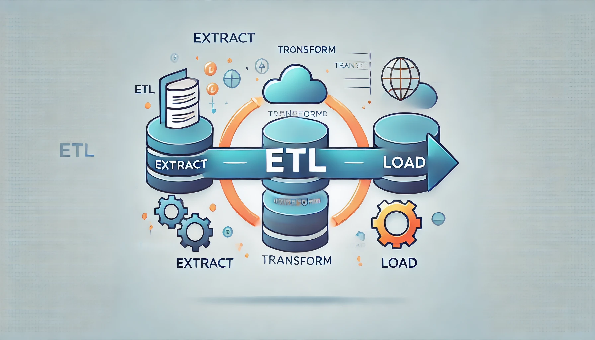

# Retail Orders Analysis: End-to-End ETL Project

This project involves analyzing retail order data using Python for data cleaning, SQL Server for data storage, and SQL queries for insights.

## Project Workflow

1. **Data Acquisition**: Download the dataset from Kaggle.
2. **Data Cleaning and Transformation**: Use Python and Pandas to clean and transform the data.
3. **Data Loading**: Load the cleaned data into SQL Server.
4. **Data Analysis**: Use SQL queries to generate insights.
